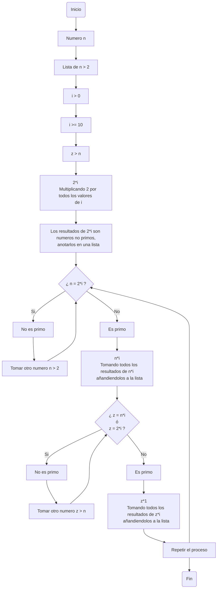

# Reto #3

1.Plantear el algoritmo para obtener los números primos hasta n, usando pseudocódigo y diagramas de flujo.

- Pseudocodigo:
    
- Diagrama de flujo:

Revise el procedimiento matemático para hallar raíces cuadradas (son divisiones y restas), plantee el algoritmo en pseudocódigo y en diagrama de flujo.

Cree un repositorio en github en donde muestre el desarrollo de la actividad y comparta el enlace por el canal de slack reto_3.
