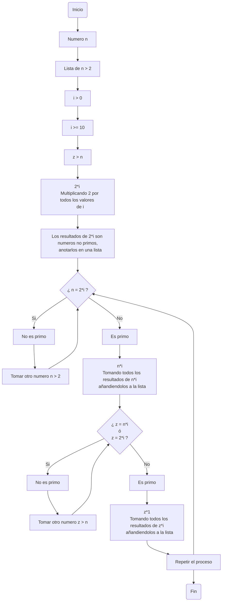
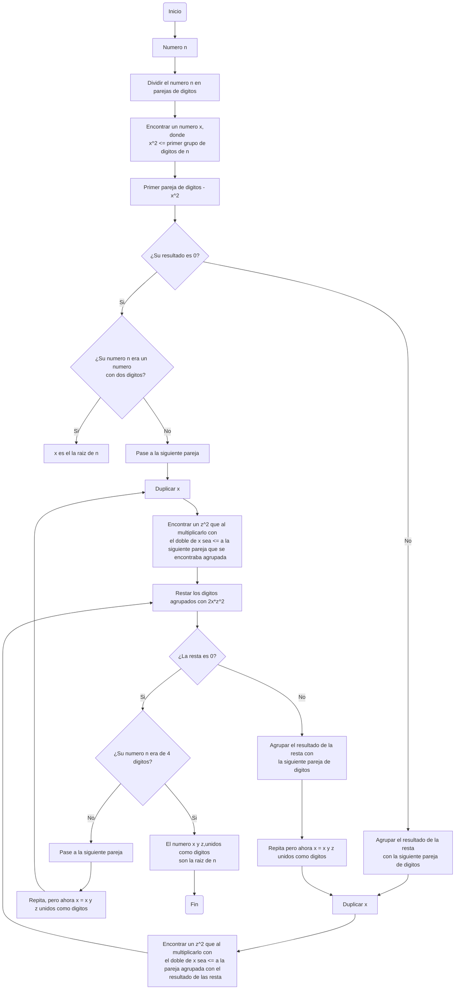

# Reto #3

1. Plantear el algoritmo para obtener los números primos hasta n, usando pseudocódigo y diagramas de flujo.

- Pseudocodigo:

```pseudocode

    n : entero
    Z : entero

    Inicio

        Mientras 2 < n

        Mientras (0 < i <= 10) hacer

            Si n = 2*i  Entonces

                Escribir (" n no es primo ");

            Si no Si n ≠ 2*1 Entonces

                Escribir (" n es primo ");

            Fin Mientras  n < z hacer

                Si z = n*1 Entonces

                    Escribir (" z no es primo");

                Si no Si z ≠ n*1

                    Escribir (" z es primo ")

            Fin Mientras

    Fin


```
    
- Diagrama de flujo:



2. Revise el procedimiento matemático para hallar raíces cuadradas (son divisiones y restas), plantee el algoritmo en pseudocódigo y en diagrama de flujo.

- Pseudocodigo:

```pseudocode

    n : Entero
    x : Entero
    z : Entero

    Inicio
        Dividir n en parejas de digitos;
            Mientras x^2 <= primera pareja de digitos de n Hacer
                Si (Primera pareja de digitos de n - x^2)=0
                    Si (n < 100) entonces
                        escribir ("x es raiz de n")
                    Si no
                        Pasar a la siguiente pareja de n;
                                Mientras z^2 <= la siguiente pareja de digitos n Hacer
                                    Si (Siguiente pareja de digitos de n - 2x*(z*z)=0)
                                        Si (n < 10000) entonces
                                            escribir ("xy son la raiz de n")
                                        Si no
                                            Pasar a la siguiente pareja de n;
                                Repetir ahora x = xz
//¿Como se usa repetir o como puedo hacer repetir una secuencia?
                Si no
                    agrupar el resultado de la resta con la siguiente pareja de digitos del numero n;
                    Mientras z^2 <= la siguiente pareja de digitos n con el resultado de la resta Hacer
                         Si (Siguiente pareja de digitos de n - 2x*(z*z)=0)
                            si (n < 10000) entonces
                                Escribir ("xy son la raiz de n")
                            Si no
                                Pasar a la siguiente pareja de n
                           
                    Repetir ahora x=xz
            Fin Mientras
        Fin
```

- Diagrama de flujo


